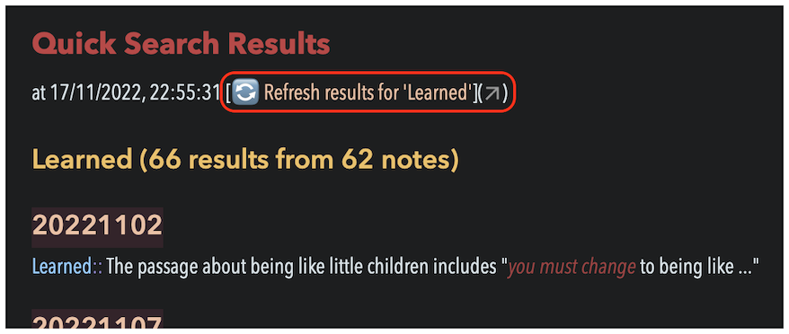
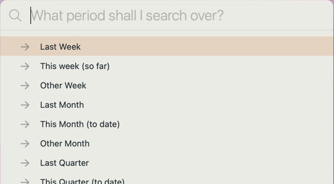
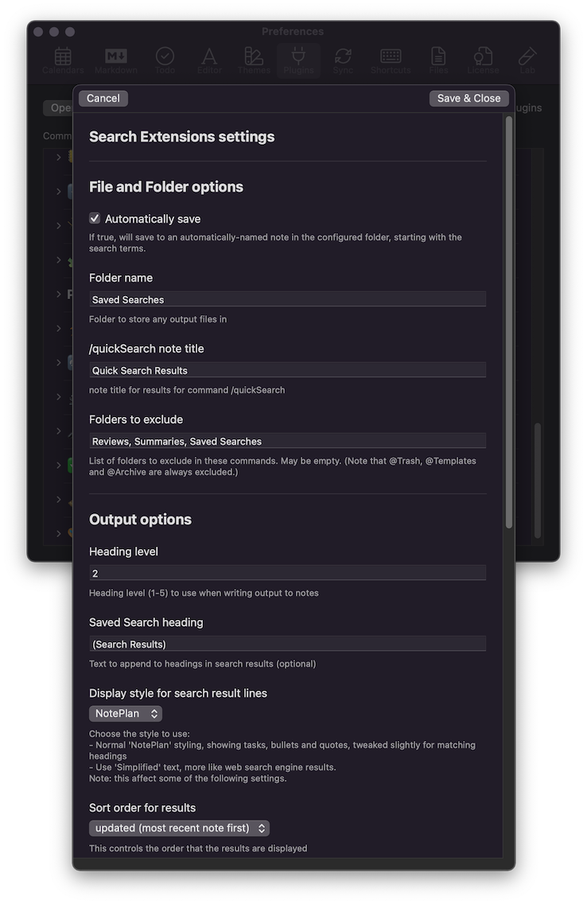

# 🔎 Search Extensions plugin
NotePlan can search over your notes, but it is currently not very flexible or easy to use; in particular it's difficult to navigate betwen the search results and any of the actual notes it shows.   This plugin attempts to add some power and usability to searching.  Most things can be configured, but by default the search runs and **saves the results in a note that it opens as a split view** next to where you're working.


Another neat feature is the inclusion of a " [Click to refresh these results]" pseudo-button under the title of the note. Clicking that runs the search again, and replaces the earlier set of results. (Thanks to @dwertheimer for the suggestion, which uses the x-callback mechanism -- see below.)



There are two /commands:


1. **/saveSearchResults** searches across **all notes** (both calendar and projects) for text string(s) you give.
2. **/saveSearchResultsInPeriod**: searches over the **daily <!--and weekly--> notes** of the time period you select:



The note is saved with the search terms as its title, in a "Saved Searches" folder (which is created if necessary). If the same search terms are used again they will *update* the same note.  But you also are given the option of saving to the current note, or to the plugin console.

As the results are saved to a note, the following sorts of uses are then possible:
- keep track of all the great `@win`s or clever `#idea`s you noted down
- show all the things you had `Gratitude:` for in your daily journal

## Notes about searches
- the **searches** are simple ones, matching on whole or partial words, not using fuzzy matching or regular expressions
- to search for terms X or Y use `X, Y` or `X OR Y`
- you can set default search terms (in the `Default Search terms` setting); if set you can still always override them.
- all notes in the special folders (@Archive, @Templates and @Trash) are ignored.  Others can be exluded too using the "Folders to exclude" setting.

## Notes about results output
There are two ways results can be displayed, controlled by the "Group results by Note?":
1. matches found within the same note are grouped together ('true', the default)
2. every match is shown with a note link at the end of the match ('false')

The length of the quote of the matched line can be limited by the "Result quote length" setting.

## Configuration
To change the default **configuration**, click the gear button on the 'Search Extensions' line in the Plugin Preferences panel to configure this plugin. Each setting has an explanation.



## Results highlighting
To see **highlighting** of matching terms in the output, you'll need to be using a theme that highlights lines using `==this syntax==`. You can customise an existing theme by adding something like:

```jsonc
{
  ...
    "highlighted": {
      "regex": "(==)([^\\s].+)(==)",
      "backgroundColor": "#55D2D21B",
      "order": 35,
      "matchPosition": 2,
      "isRevealOnCursorRange": true
    },
    "highlighted-left-marker": {
      "regex": "(==)([^\\s].+)(==)",
      "color": "#AA45A2E5",
      "backgroundColor": "#7745A2E5",
      "isMarkdownCharacter": true,
      "isHiddenWithoutCursor": true,
      "isRevealOnCursorRange": true,
      "matchPosition": 1
    },
    "highlighted-right-marker": {
      "regex": "(==)([^\\s].+)(==)",
      "color": "#AA45A2E5",
      "backgroundColor": "#7745A2E5",
      "isMarkdownCharacter": true,
      "isHiddenWithoutCursor": true,
      "isRevealOnCursorRange": true,
      "matchPosition": 3
    },
  ...
}
```

### Using from x-callback calls
It's possible to call these commands from [outside NotePlan using the **x-callback mechanism**](https://help.noteplan.co/article/49-x-callback-url-scheme#runplugin). The URL calls all take the same form:
```
noteplan://x-callback-url/runPlugin?pluginID=jgclark.SearchExtensions&command=<encoded command name>&arg0=<encoded string>&arg1=<encoded string>
```
Notes:
- the number and order of arguments you pass is important
- where an argument isn't valid, don't include it
- as with all x-callback URLs, all the arguments (including the command name) need to be URL encoded. For example, spaces need to be turned into '%20'.

| Command | x-callback start | arg0 | arg1 | arg2 |
|-----|-------------|-----|-----|-----|
| /saveSearchResults | `noteplan://x-callback-url/runPlugin?pluginID=jgclark.SearchExtensions&command=saveSearchResults&` | search term(s) (separated by commas) |  |  |
| /saveSearchResultsInPeriod | `noteplan://x-callback-url/runPlugin?pluginID=jgclark.SearchExtensions&command=saveSearchResultsInPeriod&` | search term(s) (separated by commas) | start date to search over (YYYYMMDD or YYYY-MM-DD format). If not given, then defaults to 3 months ago. | end date to search over (YYYYMMDD or YYYY-MM-DD format). If not given, then defaults to today. |

## History
Please see the [CHANGELOG](CHANGELOG.md).
