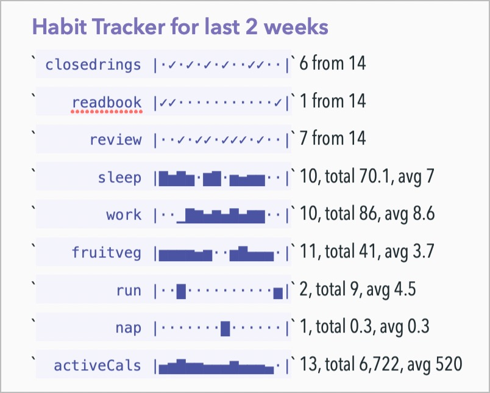
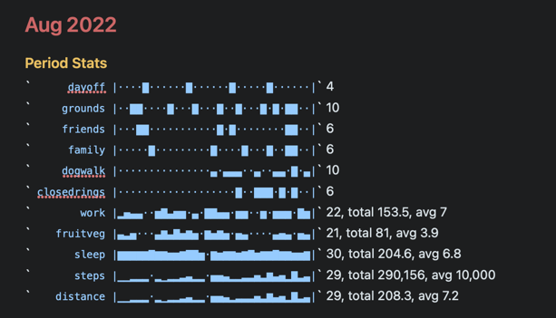

# ⏱ Habits and Summaries plugin

This Plugin lets you do the following sorts of things:
- track habits: for example, show when this week I've managed to `#closedmyrings` or `#tookMeds`? 

- show your progress over the last 2 weeks against your goal of getting an average 8 hours `@sleep`
- count every time you've noted you've visited  `#family` or watched `#tv` this month
- count the times you've met with staff member `@alice` this year so far
- sum the length of your `@run`s in the last quarter
- show a heatmap chart of how many tasks you've completed recently


It does this by providing commands that generate several different sorts of **summaries** and **basic stats from your daily notes**.

Each command is considered in turn. **Please note** that in each of these: 
- all notes in the special folders (@Archive, @Templates and @Trash) are **ignored**.  Others can be exluded too using the `foldersToExclude` setting.
- these commands require **some setup**, so it knows what you want to summarise. Do this in the Plugin Preferences panel by clicking the gear button on the 'Summaries' line. Each setting has an explanation, and they are grouped into relevant sections.

(Note: the /savedSearch commands now live in the separate [SearchExtensions plugin](https://github.com/NotePlan/plugins/tree/main/jgclark.SearchExtensions/).)

### Sparkline graphs
If wanted, the command output will include little "**sparkline**" graphs, as a simple in-line visualisation of the recorded activity for each item you're tracking, where the time period is a month or less. A dot `.` indicates there's no data for that day; the height of the bar indicates the value of that day, relative to the maximum in that time period. The mimimum is always 0, not the lowest value, and that is always shown as an empty space.

To display them requires your font to have the necessary characters (`▁▂▃▄▅▆▇█`). All of NotePlan's built-in themes have the characters, and I have tested with Menlo and Cascadia Code monospace fonts as well.  See [NotePlan help on how to set fonts in themes](https://help.noteplan.co/article/44-customize-themes#fonts).

In particular it uses the `code` attribute of the theme (if set). Here's an example from one of my themes:
```json
	"code": {
		"font": "Menlo-Regular",
		"color": "#3B3AB2",
        "backgroundColor": "#F4F4FB"
    },
```

Note: According to [several](https://wiki.mobileread.com/wiki/List_of_fonts_included_with_each_device) [sources](http://iosfonts.com/) the only monospace fonts on iPhone/iPad are forms of Courier (e.g. `Courier-Bold`) and Menlo (e.g. `Menlo-Regular`).

## /heatmap for complete tasks
This displays a 'heatmap' chart of many tasks you've completed on each day (see example above). It uses the `@done(...)` dates in all daily, weekly and project notes over the number of weeks you specify to look back (via the 'Chart Duration (in weeks)' setting). If you don't set it, the plugin will generate a sensible period up to 12 months.  It also counts completed tasks without `@done(...)` dates on Calendar notes, assuming the tasks were completed on the day or start of week in question.

(NotePlan automatically appends a 'completion date' to completed tasks if you have the Preferences > Todo > Append Completion Date setting turned on.)

Note: This is a first attempt at generating heatmaps, and I want to make it much more flexible in future. But this will probably require rolling my own charts, rather than using one from AnyChart, which if you rely on it should be licensed.

## /insertProgressUpdate
As NotePlan is such a flexible app, there are [various ways people use it to track habits](https://help.noteplan.co/article/144-habit-tracking). 
 
This Plugin command helps show progress within the current week, fortnight or month against items you track (e.g. `@work(9)`, `@run(5.3)` or `#prayed`). It does this by generating stats for the configured hashtags or mentions over the time interval you select, and inserts it as a section into the destination note. If the progress update section already exists in the destination note -- if for example you have it set to insert in the weekly note -- it will be updated, rather than be repeated.

For example, it produces for me: 


(The leading @ or # is removed in the output, to avoid double-counting problems.)

The **settings** for this command are:
- What time period should the Progress update cover? Pick one of the options: 'wtd' or 'userwtd' (week to date), 'last7d' (last 7 days), 'mtd' (month to date), 'last2w' (last 2 weeks), 'last4w' (last 4 weeks). Note: `wtd` and `userwtd` behave slightly differently to each other:
  - `wtd` is the week to date using ISO standard (Monday)
  - `userwtd` is week to date using whatever you've set the start of week to be in NotePlan's 'Calendars' Preferences pane.
- Where to write the progress update? The destination note is either the 'current'ly open note, or the current 'daily' or 'weekly' note.
- Progress Heading: e.g. 'Progress Update'
- #hashtags to count: e.g. '#tv, #podcast'
- @mentions to count: e.g. '@work' -- these are counted and displayed with count, total and average
- @mentions to average: e.g. '@sleep, @fruitveg' -- these are counted and displayed as an average
- @mentions to total: e.g. '@distance, @run' -- these are counted and displayed as a total
- (new) **Yes/No items**: Comma-separated list of #hashtags and/or @mentions to track by 'did I do it this day or not?'. e.g. '#closedrings, #prayed, #tookMeds'
- Yes/No characters: sets the pair of characters to use as Yes and No in output of "Yes/No items". The first is for Yes, the second for No. Here are some you might like to use for Yes: ✓✔■⧫▉ and for No: ·◦✕✖◌□. (You can use emojis, such as ✅🟢❌👎🔴, but they are likely to mess up the horizontal spacing.)
- 'Include sparkline graphs?' true or false

### Using from a Template
This functionality is primarily designed to be used from a **Template** (particularly a "Daily Note Template") by including the command tag:
```
<%- progressUpdate({period: 'wtd', heading: 'Habits', showSparklines: true}) %>
```
or
```
<%- progressUpdate({period: '2022-02-15', heading: 'Post-Birthday Habits', showSparklines: true}) %>
```
in a Template. This has 3 optional parameters, _which if present override the main setting described above_:
1. `period` (alias `interval`): time period to run report for, e.g. 'wtd' or 'userwtd' (week to date), 'mtd' (month to date), 'last7d', 'last2w', or 'last4w' or a specific ISO8601 date to report since (e.g. 2022-10-15)
2. `heading` to use before the results.
3. `showSparklines`: true (default) or false.

<!-- Status: ✅ = Done, 👎 = Missed, 🟠 = Average, 🟢 = Good, 🔴 = Bad -->

## /periodStats (alias: /countsInPeriod or /cip)
This command generates some simple counts and other statistics of #hashtags or @mentions that you specify, and saves them into notes in a special 'Summaries' folder. For example:
- **count** every time you've noted you've visited  family this month -- i.e. counts the number of times `#family` is mentioned in calendar notes this month
- **count** the times you've met with staff member Alice this year so far -- i.e. counts the number of times `@alice` is mentioned in calendar notes this year
- **sum** and **average** the length of your runs last quarter -- i.e. stats on all the mentions of `@run(N)` mentions (where, for example, `@run(7.5)` means a run of 7.5km/miles)
- automatically add your progress this week against your goal of getting an **average** 8 hours `@sleep()` when you log that each day.

Here's an example of what it shows with sparklines:



and without:

```markdown
# August 2022
**dayoff**: 4
**grounds**: 10
**friends**: 6
**family**: 6
**dogwalk**: 10
**closedrings**: 6
**distance**:  total 208.3 (from 29)
**fruitveg**:  avg 3.9 (from 21)
**run**:  total 24 (from 4)
**sleep**:  avg 6.8 (from 30)
**work**:  total 153.5, avg 7 (from 22)
```

It starts by asking for the time period you wish to operate over:


It asks where to save its output: to screen, to the Plugin Console, or to a specially-created note in the Summaries folder. From NotePlan v3.6 it will also offer to write to the current Weekly note if the selected time period is 'Week (to date)'.

It  updates the previous note for that same time period, if it already exists.

The settings for this command are:
- Folder name: e.g. 'Summaries'
- Folders to exclude: e.g. 'Summaries', 'TEST'
- Heading level: e.g. 2
- Hashtag counts heading: e.g. '#hashtag counts',
- Mention counts heading: e.g. '@mention counts'
- Show hashtag or mention as links?
- Include Hashtags: e.g. '#holiday','#jog','#commute','#review', '#prayed'
- Exclude Hashtags: e.g. ''
- Include Mentions: e.g. '@work','@fruitveg','@water', '@sleep'
- Exclude Mentions: e.g. '@done', '@repeat'

> (Why use `@run(...)` rather than `#run(...)`? Well, it just felt more right to use `@run()` as there are already `@done(...)` and `@repeat(...)` mentions in use in NotePlan that include a value. And in NotePlan, hashtags that end with a decimal number ignore the fractional part (e.g. `#run/5.3` ignores the `.3`).  However, you can use a `#hashtag/value` if you don't mind this limitation.

## /weeklyStatsToCSV
This is a very niche command! It generates stats for the specified mentions and hashtags over a period of consecutive weeks, and write out as a CSV table to 'Summaries/weekly_stats'. This is designed for plotting using the third-party gnuplot tool.

The relevant settings for this command are:
- Folder name: e.g. 'Summaries'
- Chart Duration (in weeks): e.g. 26. If no number is given, the plugin will generate a sensible longish period up to 1 year.

## To do
- if/when NotePlan makes this possible, show proper graphs of numeric summaries. (The 'ASCII art' sparklines are hopefully an interim step towards this.)

## Support
If you find an issue with this plugin, or would like to suggest new features for it, please raise a [Bug or Feature 'Issue'](https://github.com/NotePlan/plugins/issues).

If you would like to support my late-night work extending NotePlan through writing these plugins, you can through:

[](https://www.buymeacoffee.com/revjgc)

Thanks!

## History
The Plugin was originally known simply as 'Summaries'. Please see the [CHANGELOG](CHANGELOG.md).

## Thanks
Thanks to GitHub user zz85 whose code for [ASCII art sparklines](https://github.com/zz85/ascii-graphs.js) I adapted and improved in v0.12.
