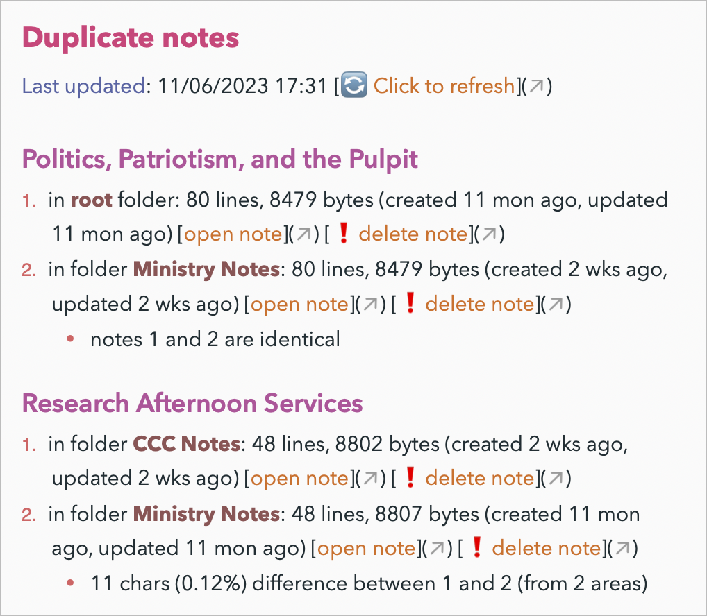

# 🧹 Tidy Up plugin

This plugin provides commands to help tidy up your notes:

- **/File root-level notes** (alias "frnl"): For each root-level note, asks which folder you'd like it moved to. (There's a setting for ones to permanently ignore.)
- **/List conflicted notes**: creates a new NP note that lists all your notes on your current device with file-level conflicts, along with summary details about them.
- **/List duplicate notes**: creates a new note that lists all your notes with identical titles, along with summary details about those potential duplicates:
    
- **/Remove blank notes**: deletes any completely blank notes, or just with a starting '#' character.
- **/Remove orphaned blockIDs** (alias "rob"): Remove blockIDs from lines that had been sync'd, but have become 'orphans' as the other copies of the blockID have since been deleted.
- **/Remove section from recent notes** (alias "rsfrn"): Remove a given section (heading + its content block) from recently-changed notes. Can be used with parameters from Template or x-callback.
 - **/Remove content under heading in all notes** (alias "rcuh"). Use wisely, as this is dangerous! (original function by @dwertheimer)
- **/Remove time parts from @done() dates** (alias "rtp"): Remove time parts of @done(date time) from recently-updated notes. Can be used with parameters from Template or Callback.
- **/Remove @done() markers** (alias "rdm"): Remove @done(...) markers from recently-updated notes, optionally just from completed checklist items.
- **/Remove triggers from recent calendar notes** (alias "rtcn"): Remove one or more triggers from recent (but past) calendar notes.

Most can be used with parameters from a Template, or via an x-callback call.

There's also the **/Tidy Up** (alias "tua"), which runs as many of the other commands in this plugin as you have configured in its Settings.

## Using from Templates
If these commands are valuable to you, then you probably want to be running them regularly. NotePlan doesn't (yet) allow fully automatic running of commands, but you can get close by including the commands in your Daily Note Template that you run each day (e.g. via the separate /dayStart command from my [Daily Journal plugin](https://github.com/NotePlan/plugins/blob/main/jgclark.DailyJournal/README.md)).

To call one of these commands from a Template use this Templating command:

`<% await DataStore.invokePluginCommandByName("<command name>","np.Tidy",['<parameters>'])  %>`

The parameters are passed as `"key":"value"` pairs separated by commas, and surrounded by curly brackets `{...}` (JSON encoding). Note the parameters then need to be surrounded by square brackets and single quotes.

For example, this will remove sections with the heading 'Habit Progress' from notes changed in the last 2 days, running silently:

`<% await DataStore.invokePluginCommandByName("Remove section from notes","np.Tidy",['{"numDays":2, "sectionHeading":"Habit progress", "runSilently": true}'])  %>`

**Tip:** as these are complicated and fiddly to create, **I suggest you use @dwertheimer's excellent [Link Creator plugin](https://github.com/NotePlan/plugins/blob/main/np.CallbackURLs/README.md) command "/Get X-Callback-URL"** which makes it much simpler.

<!-- but if not ??? list params -->

## Using from x-callback calls
It's possible to call most of these commands from [outside NotePlan using the **x-callback mechanism**](https://help.noteplan.co/article/49-x-callback-url-scheme#runplugin). The URL calls all take the same form:

`noteplan://x-callback-url/runPlugin?pluginID=np.Tidy&command=<encoded command name>&arg0=<encoded parameters>`

Notes:
- all parameters are passed as `"key":"value"` pairs separated by commas, and surrounded by curly brackets `{...}`. (This is JSON encoding.)
- as with all x-callback URLs, all the arguments (including the command name) need to be URL-encoded. For example, spaces need to be turned into '%20'.

This is an example of a fully URL-encoded call:

| un-encoded call | URL-encoded call |
| ----- | ----- |
| `noteplan://x-callback-url/runPlugin?pluginID=np.Tidy&command=Remove section from notes&arg0={"numDays":20, "sectionHeading":"Test Delete Me"}` | `noteplan://x-callback-url/runPlugin?pluginID=np.Tidy&command=Remove%20section%20from%20notes&arg0=%7B%22numDays%22%3A%202%2C%20%22sectionHeading%22%3A%22Test%20Delete%20Me%22%7D` |

The available parameters are:

| command name | parameter name |
| --------- | --------- |
| List conflicted notes | runSilently |
| List duplicate notes | runSilently |
| Remove @done() markers | foldersToExclude, justRemoveFromChecklists, numDays, runSilently |
| Remove orphaned blockIDs | runSilently |
| Remove section from all notes | keepHeading, runSilently, sectionHeading |
| Remove section from recent notes | matchType, sectionHeading |
| Remove time parts from @done() dates | runSilently |
<!-- | File root-level notes | rootNotesToIgnore | -->

**Tip:** as these are complicated and fiddly to create, **I strongly suggest you use @dwertheimer's excellent [Link Creator plugin]() command "/Get X-Callback-URL"** which makes it vastly easier.

## Configuration
Click the gear button on the '🧹 Tidy Up' line in the Plugin Preferences panel, and fill in the settings accordingly. Defaults and descriptions are given for each one.

## Thanks
@dwertheimer wrote one of the functions used in this plugin, and helped beta test much of the plugin.

## Support
If you find an issue with this plugin, or would like to suggest new features for it, please raise a [Bug or Feature 'Issue'](https://github.com/NotePlan/plugins/issues).

If you would like to support my late-night work extending NotePlan through writing these plugins, you can through:

Thanks!

## History
Please see the [CHANGELOG](CHANGELOG.md).
