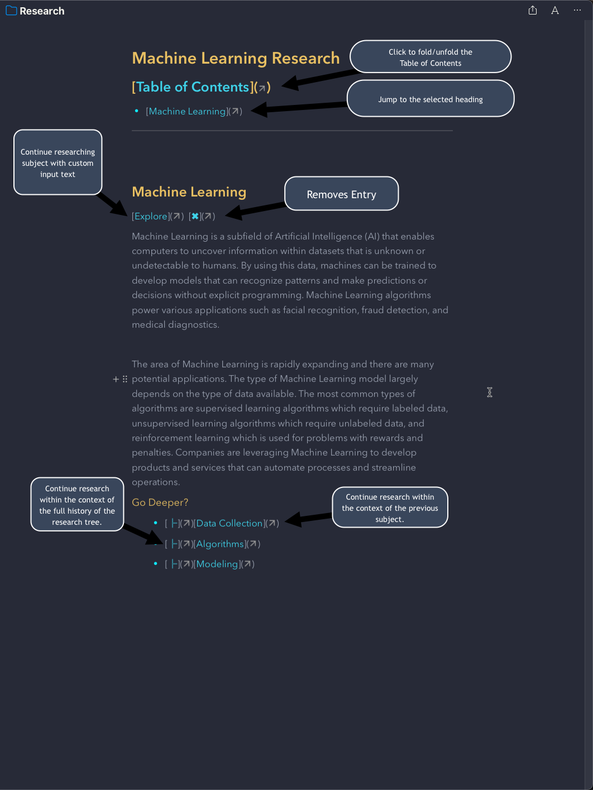

# NotePlan AI Plugin

## Latest Updates

See [CHANGELOG](https://github.com/NotePlan/plugins/blob/main/shared.AI/CHANGELOG.md) for latest updates/changes to this plugin.

## About This Plugin

**NotePlan AI** is a plugin designed to facilitate a number of AI related tasks using the OpenAI text-to-AI API.

In its initial stage, the plugin serves as a research assistant; designed to help you learn more about any subject you wish.

### Getting Started

1. Set up an OpenAI account: To get started, you'll first need to go to the [OpenAI website](https://openai.com/api/) and sign up for an account.

2. Set up OpenAI billing information: In order to make requests and get responses from OpenAI, you have to have a credit card on file. Using OpenAI is [incredibly inexpensive](https://openai.com/pricing), but they do require a credit card to be on file before you can call their servers for information. You can do that here: [Billing Overview](https://platform.openai.com/account/billing/overview). Click on "Set up paid account" and put in your billing information.

3. Get an OpenAI API key: Once your account has been created and your billing info set up, you'll need to get an API key. Go to the [API Keys page](https://beta.openai.com/account/api-keys) page and click on "+ Create new Secret Key".

>***IMPORTANT:*** This API key should be saved in a secure location since you will not be able to see it again after you leave the page. Copy this key to your clipboard using the button on the right side of the key.

### On the Mac

In NotePlan, open the NotePlan AI Preferences page, go to Plugins, "NotePlan AI", and add the API Key in the first field and save. Feel free to adjust any other settings in here at this time (though you may wish to start with them at the default values).

### On iPhone/iPad

See the instructions below for the command `/Update settings/preferences`

That's it! With your API key safely in the preferences, you can now use all the commands in the following section.

**A note regarding costs**

*Using the OpenAI API is not free.* Fortunately, it is extremely cost effective and does provide a number of tools to help you self-moderate the amount you spend on the service. There is no monthly charge. Rather, you pay per 1000 tokens used.

>**Example**:
A search for "Tell me about the planet Mercury" with the max_tokens target set to 1,000 tokens (words more-or-less) will cost approximately $0.02 using OpenAI's (most expensive) models -- daVinci or chatGPT.

I strongly encourage you to explore the pricing information available on the [OpenAI website](https://openai.com/api/pricing/).

---

### Main Commands

- **/Create Chat**

    >This command creates a new document with a GPT3 chat. You can ask an initial question and then follow up as many times as you would like, and the AI will "remember" the context of your conversation.

- **/Insert Chat**

    >This command is just like "Create Chat", but instead of creating a brand-new document, the results will be inserted at the cursor position.

- **/createResearchDigSite**

    >This is the primary command to be used when starting to research a new subject. When called, you simply type in whatever subject you'd like to learn more about and then let it work its magic. The generated research will be placed into a folder titled "/Research" by default. This can be adjusted in the plugin preferences.

- **/Update settings/preferences (use on iPhone/iPad)**

    >Use this command to update your preferences/settings on the iPhone and iPad, which do not have a Plugins panel or plugin settings. You can still access/set this plugin's settings using an interactive menu.

    *You Should Know*

    >This command can also be called by its much shorter alias: **/dig**

    >If you have text highlighted, it will autofill the subject line so you can just press "Enter" to quickly research the selected text.

- **/Create AI Images**

    >Use words to have the AI generate images/art using DALL-E @ OpenAI.

-

### Other Commands

- **/researchFromSelection**

    >This command will research the selected text *in the context of the current research subject.* The generated research will be formatted and appended to the bottom of the current note.

- **/moveNoteToResearchCollection**

    >This command will move the current note into an existing or new sidebar directory within the Research tree. The command will also generate a Table of Contents at the top level of the directory to allow for quick access to the related ideas that you have researched.

- **/Show NotePlan AI Commands**
    > Shows an interactive list of all available NotePlan AI commands.

---

### The Anatomy of a Research Note

### Preferences

- **OpenAI API Key**

    >You must provide your OpenAI API Key in order to use the platform.
    >Visit [your account page](https://beta.openai.com/account/api-keys) for more information.

- **Default Text Model**

    >The model to use when generating your responses. Generally, use *text-davinci-003* for the most useable results. Other models are useful, but will more than likely result in unusable responses due to their limited support for understanding context and formatting.

- **Research Directory**

    >Set the directory where you'd like to store the research results.

- **Target Summary Paragraphs**

    >The number of paragraphs that you'd like the AI to generate for your summary results.

    *You Should Know*

    >The more paragraphs, the longer the response will take to generate and the higher the cost of the response.

- **Target Key Terms**

    >The number of key terms to be generated by the AI with each summary response.

- **Show Stats**

   >Currently not functioning properly in all cases. Best to leave unchecked for the time being.

- **Max Tokens**

    >The maximum number of tokens allowed for each response to use. 1000 tokens is ~750 words as a very rough estimate.

    >OpenAI charges you by the "token" you send and receive. A typical request uses up ~82 tokens. You can set the max response to limit the size of the response.

---

### Learn more about OpenAI

- **[Overview](https://openai.com/product)**
- **[Cost/Pricing](https://openai.com/pricing)**
- **[Privacy of Your Data](https://openai.com/policies/api-data-usage-policies)**
